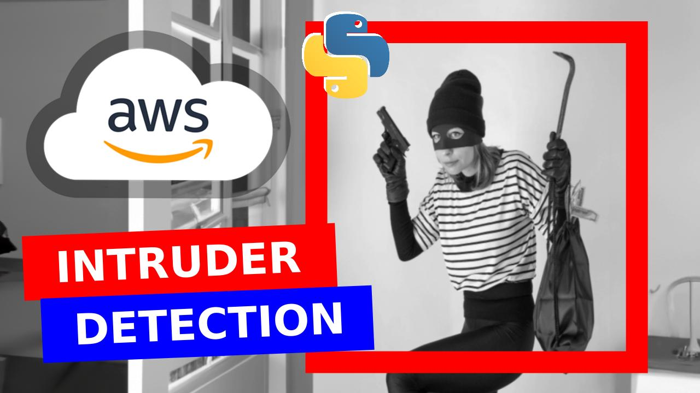

# intruder-detection-python-aws-surveillance

## pipeline

    

## code

If you watch the video, you'll notice a minor bug towards the end. It pertains to the consumer responsible for the intruder detection in the code that adds a new item to the database. The issue has been addressed in the corrected code provided [here](https://github.com/computervisioneng/intruder-detection-python-aws-surveillance/blob/main/intruder-detection/kvs_consumer_library_example.py).  

## execution

### setting up producer

Please go [here](https://github.com/awslabs/amazon-kinesis-video-streams-producer-sdk-cpp) for a more comprehensive explanation of how to setup the producer depending on your OS.

This is how to set it up from Ubuntu:

      sudo apt update

      git clone https://github.com/awslabs/amazon-kinesis-video-streams-producer-sdk-cpp.git

      mkdir -p amazon-kinesis-video-streams-producer-sdk-cpp/build

      cd amazon-kinesis-video-streams-producer-sdk-cpp/build

      sudo apt-get install libssl-dev libcurl4-openssl-dev liblog4cplus-dev libgstreamer1.0-dev libgstreamer-plugins-base1.0-dev gstreamer1.0-plugins-base-apps gstreamer1.0-plugins-bad gstreamer1.0-plugins-good gstreamer1.0-plugins-ugly gstreamer1.0-tools

      sudo apt  install cmake

      sudo apt-get install g++

      sudo apt-get install build-essential
  
      cmake .. -DBUILD_DEPENDENCIES=OFF -DBUILD_GSTREAMER_PLUGIN=ON

      make

      sudo make install

      cd ..

      export GST_PLUGIN_PATH=`pwd`/build

      export LD_LIBRARY_PATH=`pwd`/open-source/local/lib

- Go to Kinesis Video Streams and create a new video stream.
- Go to IAM and create a new user with **AmazonKinesisVideoStreamsFullAccess** permissions.
- Select the IAM user you created, go to _Security credentials_ and create access keys.
- Execute the following command:

      gst-launch-1.0 v4l2src do-timestamp=TRUE device=/dev/video0 ! videoconvert ! video/x-raw,format=I420,width=640,height=480,framerate=30/1 ! x264enc  bframes=0 key-int-max=45 bitrate=500 ! video/x-h264,stream-format=avc,alignment=au,profile=baseline ! kvssink stream-name=STREAM-NAME storage-size=512 access-key=ACCESS_KEY secret-key=SECRET_KEY aws-region=REGION_NAME

### setting up consumer #1: backup

- Go to S3 and create an S3 bucket.
- Go to EC2 and launch a t2.medium instance with 8GB storage size.
- Go to IAM and create an access role for the EC2 instance with the following policies: **AmazonKinesisVideoStreamsFullAccess** and **AmazonS3FullAccess**.
- Attach the IAM role to the EC2 instance.
- SSH into the EC2 instance.
- Execute the following commands in the EC2 instance:

      sudo apt update
  
      sudo apt install python3-virtualenv

      virtualenv venv --python=python3
  
      source venv/bin/activate
  
      git clone https://github.com/aws-samples/amazon-kinesis-video-streams-consumer-library-for-python.git

      cd amazon-kinesis-video-streams-consumer-library-for-python
  
      pip install -r requirements.txt

- Edit region name and stream name.
- Add backup funcionality.
- Execute the following commands:

      cd ~/amazon-kinesis-video-streams-consumer-library-for-python
      python kvs_consumer_library_example.py

### setting up consumer #2: intruder detection

- Go to S3 and create an S3 bucket.
- Go to DynamoDB and create a table.
- Go to SNS and create a new topic.
- Select the topic you created and create a new subscription.
- Go to the S3 bucket you created and create a new event notification.
- Go to EC2 and launch a t2.medium instance with 8GB storage size.
- Go to IAM and create an access role for the EC2 instance with the following policies: **AmazonKinesisVideoStreamsFullAccess**, **AmazonDynamoDBFullAccess**, **AmazonS3FullAccess** and **AmazonRekognitionFullAccess**.
- Attach the IAM role to the EC2 instance.
- SSH into the EC2 instance.
- Execute the following commands in the EC2 instance:

      sudo apt update
  
      sudo apt install python3-virtualenv

      virtualenv venv --python=python3
  
      source venv/bin/activate
  
      git clone https://github.com/aws-samples/amazon-kinesis-video-streams-consumer-library-for-python.git

      cd amazon-kinesis-video-streams-consumer-library-for-python
  
      pip install -r requirements.txt

      sudo apt-get update && sudo apt-get install ffmpeg libsm6 libxext6  -y

- Edit region name and stream name.
- Add intruder detection funcionality.
- Execute the following commands:

      cd ~/amazon-kinesis-video-streams-consumer-library-for-python
      python kvs_consumer_library_example.py
